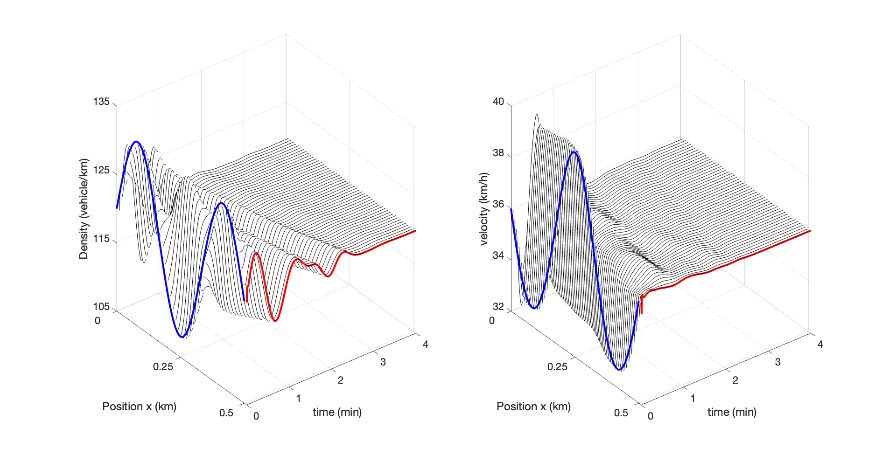
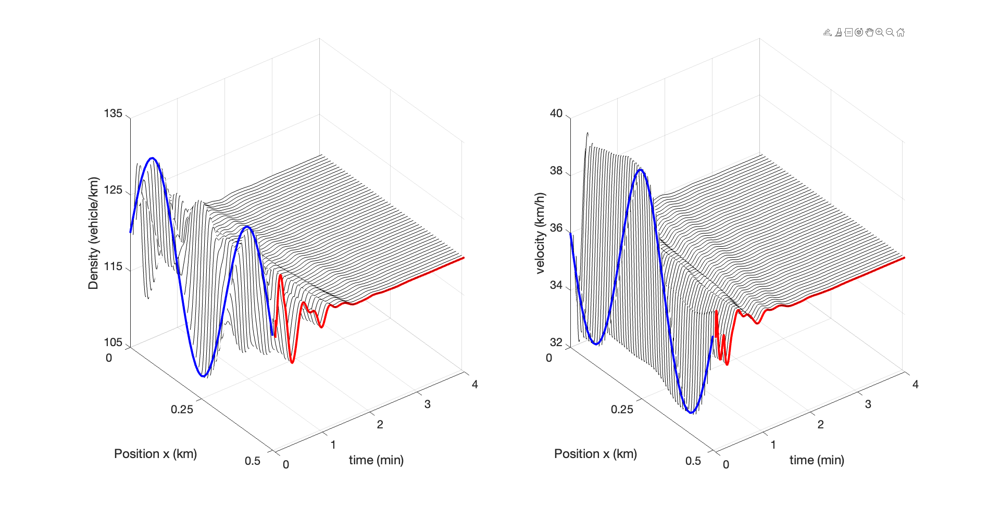
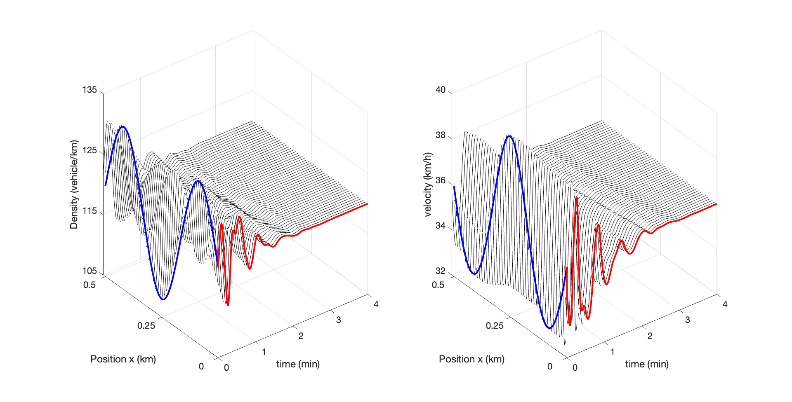
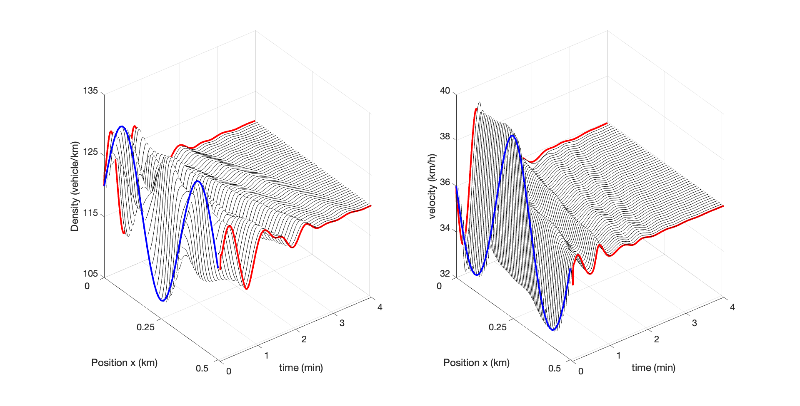
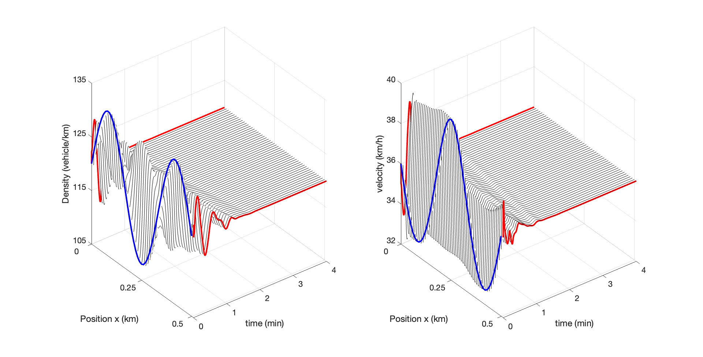

# RL-ARZ-PPO

This is the application of reinforcement learning (RL) for Aw-Rascle-Zhang (ARZ) Traffic Model using proximal poloicy optimization ([PPO](https://github.com/openai/baselines/tree/master/baselines/ppo1)). The implementation is based on "[PyTorch Implementations of Reinforcement Learning Algorithms](https://github.com/ikostrikov/pytorch-a2c-ppo-acktr-gail)", and modified with the application of ARZ simulator.

## Requirements

* Python 3 (it might work with Python 2, but I didn't test it)
* [ARZ Simulator](https://github.com/saehong/gym_arz_sim)
* [PyTorch](http://pytorch.org/)
* [OpenAI baselines](https://github.com/openai/baselines)

## How to run

* In the "settings_file.py", the parameters of ARZ simulator are defined. For RL training configuration, the hyper-paramters are defined in "main.py".

* You can simply run the code and reproduce the results by following:

```bash
# Training
python main.py

```

* After training the RL agent, one can evaluate the performance of RL controller by executing:
```bash
# Evaluation & Visualization
python evaluation_RL.py

```

* Model-based baselines, i.e., Openloop, Backstepping, P, and PI controllers, are executed by following:
```bash
# Openloop control
# Evaluation & Visualization
python evaluation_Openloop.py

```

```bash
# Backstepping control
# Evaluation & Visualization
python evaluation_Backstep.py

```

```bash
# P control
# Evaluation & Visualization
python evaluation_P_control_inlet.py

```

```bash
## PI control
# Evaluation & Visualization
python evaluation_PI_control_Inlet_N_Outlet.py

```

Figures and Results are saved in "save_plot_results" and "save_mat" folder in the repository. The figures in the manuscript are generated by running "Matlab_states_plot.m" in "save_mat" folder.

## Results (Matlab Figures)

### BackStepping Outlet Control



### RL Outlet Control



### P Inlet Control


### RL Inlet Control



### PI Outlet & Inlet Control



### RL Outlet & Inlet Control




## Bibtex

## Contacts

Saehong Park: sspark@berkeley.edu

Huan Yu: huy015@ucsd.edu


